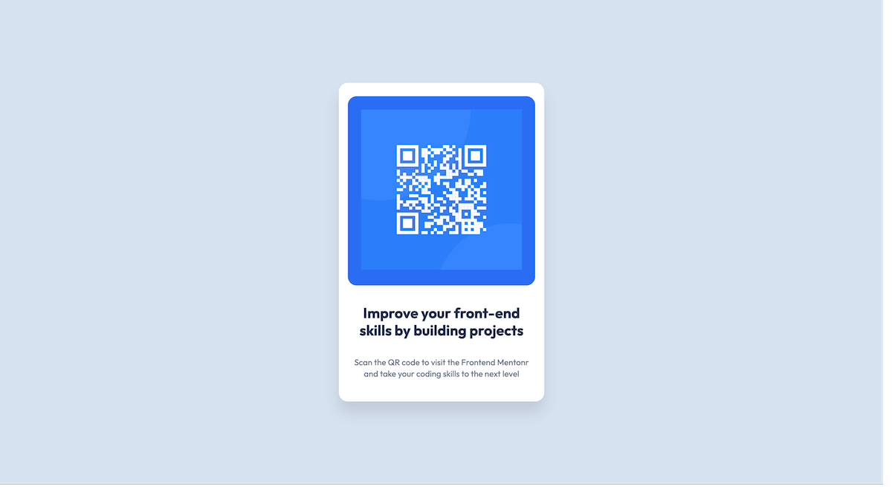

# Frontend Mentor - QR code component solution

This is a solution to the [QR code component challenge on Frontend Mentor](https://www.frontendmentor.io/challenges/qr-code-component-iux_sIO_H).

## Table of contents

- [Overview](#overview)
  - [Screenshot](#screenshot)
  - [Links](#links)
- [My process](#my-process)
  - [Built with](#built-with)
  - [What I learned](#what-i-learned)
  - [Continued development](#continued-development)
  - [Useful resources](#useful-resources)
- [Author](#author)
- [Acknowledgments](#acknowledgments)

## Overview

### Screenshot

;

### Links

- Solution URL: [Add solution URL here](https://your-solution-url.com)
- Live Site URL: [Add live site URL here](https://your-live-site-url.com)

## My process

### Built with

- Semantic HTML5 markup
- CSS custom properties and containers
- Flexbox
- CSS Grid
- Mobile-first workflow

### What I learned

Using simple code to build a nice QR Code Card. 

```css
:root {
    --slate-300: hsl(212, 45%, 89%);
    --slate-500: hsl(216, 15%, 48%);
    --slate-900: hsl(218, 44%, 22%);
    --white-color: hsl(0, 0%, 100%);
    --blue-color: hsl(220, 90%, 56%);

    --text-preset-fontFamily: "Outfit", sans-serif;

    --text-preset-1-fontSize: 1.625rem;
    --text-preset-1-lineHeight: 120%;
    --text-preset-1-letterSpacing: 0rem;


    --text-preset-2-fontSize: 0.938rem;
    --text-preset-2-lineHeight: 140%;
    --text-preset-2-letterSpacing: 0.013rem;

    --spacing-200: 1rem;
    --spacing-300: 1.5rem;
    --spacing-500: 2.5rem;

    --border-radius: 1rem;
    --container-max-width: 320px;
    --mobile-container-width: 280px; 
}
```
### Useful resources

- [CSS Tricks](https://css-tricks.com/smart-layouts-with-container-queries/) - This helped me for getting context about container queries. I really liked this pattern and will use it going forward.
- [Medium Article](https://medium.com/timeless/figmas-flexbox-cdebb6968c29) - This is an amazing article which helped me finally understand flexbox. I'd recommend it to anyone still learning this concept.

